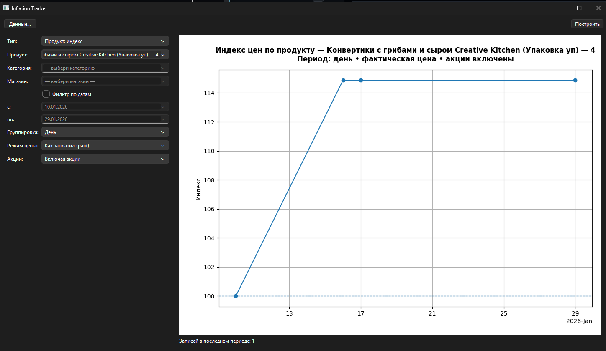
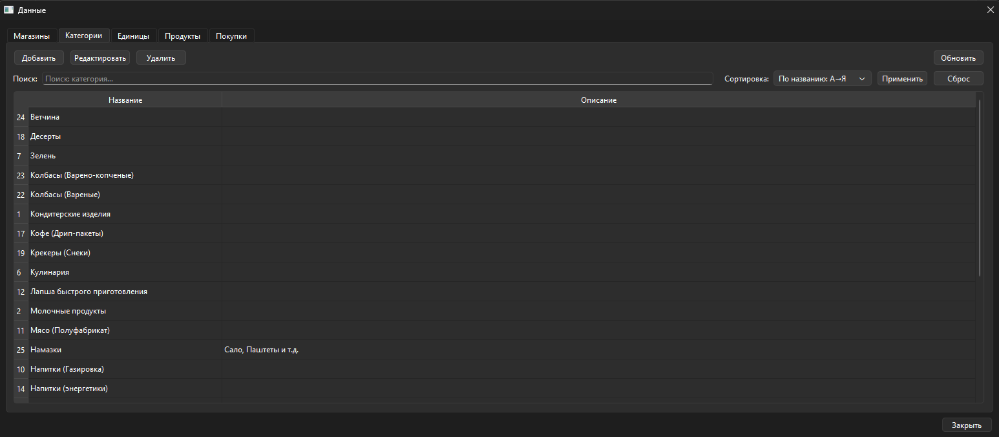
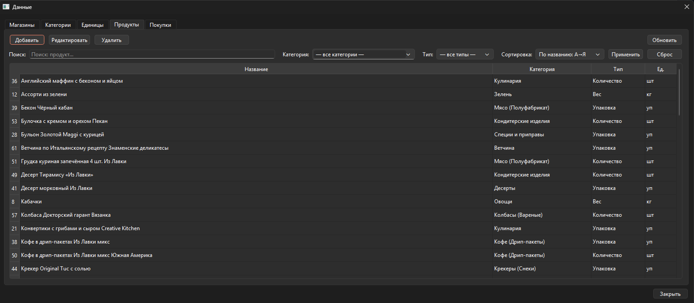
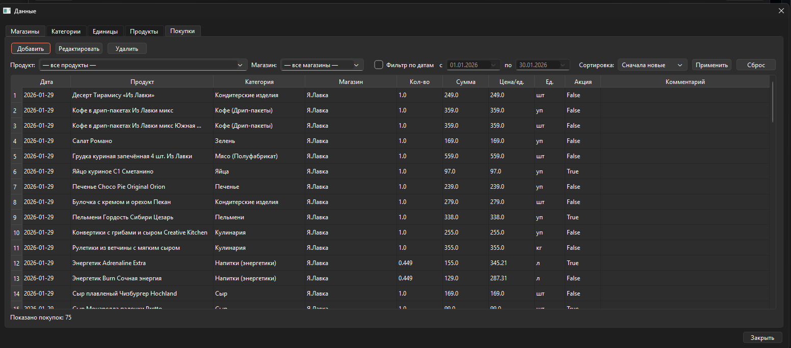
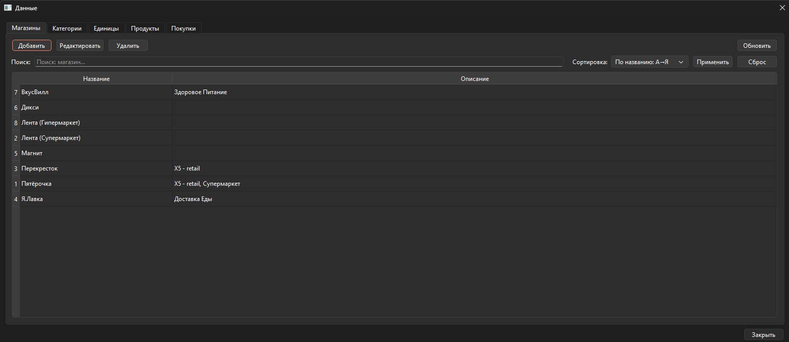
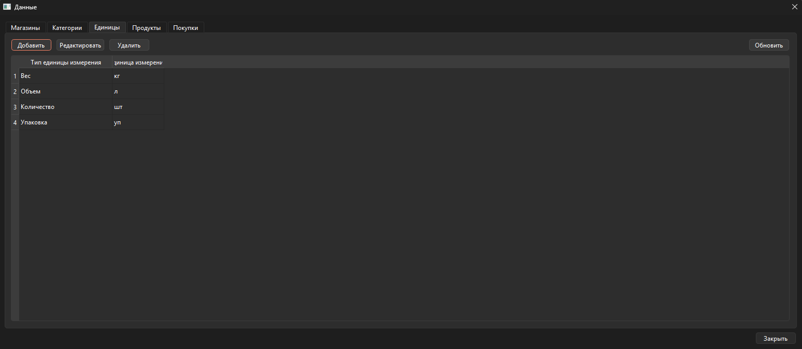

# Трекер инфляции


Небольшое приложение для учёта покупок и анализа динамики цен.
В проекте есть **CLI** для CRUD-операций и **GUI** на **PyQt6**.

---

## Возможности

- Справочники: **магазины**, **категории**, **единицы измерения**, **продукты**
- Учёт покупок: дата, количество, сумма, комментарии, промо (если включено)
- Аналитика и графики: динамика цен/инфляции по выбранным параметрам
- CLI-режим подходит для автоматизации и скриптов

## Технологический стек

| Слой | Технологии |
|---|---|
| БД / ORM | SQLite, SQLAlchemy 2.0, Alembic (миграции) |
| Бизнес-логика | Python 3.9+, pandas (аналитика, индексы цен) |
| CLI | argparse, prettytable |
| GUI | PyQt6, matplotlib |
| Тесты / CI | pytest, pytest-cov, ruff, GitHub Actions |
| Упаковка | PyInstaller (Windows .exe) |

<details>
<summary><b>Для технического ревью: архитектура и инженерные решения</b></summary>

### Слои приложения

```
app/
├── models/     # SQLAlchemy ORM-модели
├── crud/       # низкоуровневые операции с БД (select/insert/update/delete)
├── service/    # бизнес-правила, валидация, промо-логика, аналитика
├── cli/        # argparse-обвязка над сервисным слоем
└── gui/        # PyQt6-интерфейс над тем же сервисным слоем
```

CLI и GUI — два независимых клиента одного и того же сервисного слоя;
ни один из них не обращается к CRUD или к БД напрямую.

### Что может быть интересно при код-ревью

- **Аналитика** (`service/analytics.py`) считает индексы цен, включая индекс
  Ласпейреса, на pandas — по продукту, категории или магазину, с фильтрами
  по периоду и промо-акциям.
- **Промо-логика покупки** (`models/purchase.py::resolve_promo`) — правила
  согласования `is_promo`/`promo_type`/`regular_unit_price` вынесены в один
  метод вместо дублирования между созданием и обновлением записи.
- **Guard'ы на удаление** (`service/delete_guards.py`) — прикладные проверки
  перед удалением справочников (нельзя удалить категорию/магазин/единицу,
  если на неё есть ссылки), не полагаемся только на ограничения БД.
- **Логирование вызовов** (`logging/decorators.py`) — декоратор `@logged`
  с безопасной сериализацией аргументов и результата (без падений на
  тяжёлых ORM-объектах) и таймингом на старт/успех/ошибку.
- **Кэш справочников в GUI** (`gui/ref_cache.py`) — простой in-memory кэш
  с явной инвалидацией после изменений, без TTL и скрытой магии.
- **Тесты и CI**: pytest + pytest-cov на сервисный слой и CLI, `ruff` —
  в GitHub Actions на каждый PR; миграции Alembic упаковываются прямо
  в exe-сборку через PyInstaller.

</details>

---

## Быстрый старт для пользователей (Windows)

1. Открой вкладку **Releases** в репозитории и скачай архив сборки (zip).
2. Распакуй архив в любую папку.
3. Запусти `InflationTracker.exe`.

При первом запуске приложение создаст базу SQLite и автоматически применит миграции.

---

## Где лежат база и логи

По умолчанию используется SQLite, файлы создаются в каталоге состояния пользователя (чтобы работало и из исходников, и из exe).

**Windows**
- БД: `%APPDATA%\InflationTracker\inflation.db`
- Логи: `%APPDATA%\InflationTracker\logs\logs_to_YYYY-MM-DD.log`

**Linux**
- БД: `~/.local/state/InflationTracker/inflation.db`
- Логи: `~/.local/state/InflationTracker/logs/`

**macOS**
- БД: `~/Library/Application Support/InflationTracker/inflation.db`
- Логи: `~/Library/Application Support/InflationTracker/logs/`

---

## Конфигурация БД

Источник БД выбирается в следующем порядке:

1) `--db-url` (CLI) или `DB_URL` (окружение)  
2) `./inflation.db` в корне проекта (если файл существует)  
3) каталог состояния пользователя (см. выше)

Можно положить `DB_URL` в `.env` в корне проекта — он будет подхвачен автоматически.

Пример:
```bash
export DB_URL="sqlite+pysqlite:///$(pwd)/inflation.db"
```

---

## Запуск из исходников (для разработки)

### Требования

Python 3.9+

### Установка

Рекомендуемый способ:

```bash
python -m venv .venv

# Windows (bash, например Git Bash):
source .venv/Scripts/activate

# Linux/macOS:
source .venv/bin/activate

pip install -r requirements.txt
```

### Запуск

CLI:

```bash
python -m app.cli.main --help
```

GUI:

```bash
python -m app.gui.main
```

### Примеры CLI

Базовый сценарий: создать справочники, затем покупки.

```bash
# Категории
python -m app.cli.main category add "Еда" --description "Продукты питания"
python -m app.cli.main category list --table

# Единицы измерения
python -m app.cli.main units add "кг" --measure-type "Вес"
python -m app.cli.main units list --table

# Магазины
python -m app.cli.main store add "Пятёрочка" --description "Возле дома"
python -m app.cli.main store list --table

# Продукты
python -m app.cli.main product add "Яблоки" --category-id 1 --unit-id 1
python -m app.cli.main product list --table

# Покупки
python -m app.cli.main purchase add \
  --date 2025-01-20 \
  --product-id 1 \
  --store-id 1 \
  --quantity 2 \
  --total-price 199.90 \
  --promo \
  --promo-type discount \
  --regular-unit-price 129.90

python -m app.cli.main purchase list --table

# Фильтрация покупок по продукту и датам
python -m app.cli.main purchase list \
  --product-id 1 \
  --from-date 2025-01-01 \
  --to-date 2025-01-31 \
  --table
```

### Полезные опции

`--db-url` и `--echo-sql` доступны для всех CLI-команд.

`list` поддерживает `--full` (key: value) и `--table` (таблица).

---

## Скриншоты GUI



<details>
<summary>Ещё скриншоты (CRUD-вкладки: категории, продукты, покупки, магазины, единицы)</summary>







</details>

---

## Сборка exe (для сопровождающих)

Сборка делается через PyInstaller (Windows). В проекте используется подход, при котором миграции Alembic упаковываются в сборку и применяются автоматически при первом запуске.

Типовой сценарий (onedir):

```bash
pyinstaller --noconfirm --clean \
  --name InflationTracker \
  --onedir \
  --windowed \
  --add-data "alembic.ini;." \
  --add-data "alembic;alembic" \
  --collect-data matplotlib \
  --collect-data pandas \
  --collect-data numpy \
  --exclude-module matplotlib.tests \
  --exclude-module numba \
  --hidden-import=pandas.core._numba \
  run_gui.py
```

---

## Отчёты об ошибках

Если что-то пошло не так:

- приложи лог-файл из каталога логов (см. раздел выше),
- укажи версию релиза и ОС,
- опиши шаги, после которых появилась проблема.

## Предложения о новых фичах и улучшениях

Issues открыт, если у вас есть предложения о доработке программы или оптимизации решения. Welcome, рад конструктивной критике.

---

### Roadmap

- Пагинация истории покупок (сейчас список тянется целиком)
- Вынос тяжёлых аналитических расчётов в фон, чтобы не блокировать UI
- Покрытие GUI автотестами (pytest-qt)